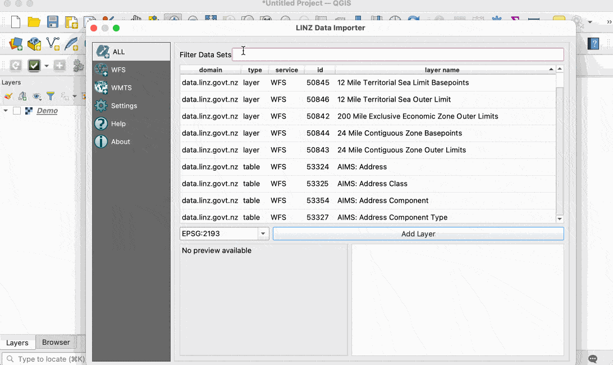
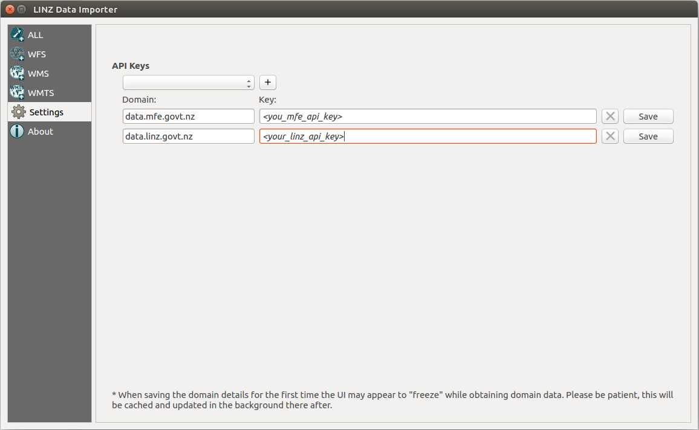

# LDS Data Importer 
[](https://github.com/linz/linz-data-importer/actions/workflows/ci.yml)
[](https://github.com/psf/black)
[](https://pycqa.github.io/isort/)
[](https://www.pylint.org/)

The intent of this QGIS Plugin is to allow the easy discovery and import of
[LINZ Data Service](data.linz.govt.nz) and [LINZ Basemaps](basemaps.linz.govt.nz) data into QGIS.



## Supported Services
As well as the LINZ Data Service, the plugin can be configured to allow the discovery and importing of data
from other New Zealand agencies that make use of the same technology platform to publish their data.

This plugin supports the below open data portals:
* [data.linz.govt.nz](http://data.linz.govt.nz) (Toitū Te Whenua - Land Information New Zealand)
* [data.mfe.govt.nz](http://data.mfe.govt.nz) (Manatū Mō Te Taiao - Ministry for the Environment)
* [datafinder.stats.govt.nz](http://datafinder.stats.govt.nz) (Tatauranga Aotearoa - Statistics New Zealand)
* [lris.scinfo.org.nz](http://lris.scinfo.org.nz) (Manaaki Whenua - Landcare Research)
* [geodata.nzdf.mil.nz](http://geodata.nzdf.mil.nz) (Te Ope Kātua o Aotearoa - New Zealand Defence Force)
* [basemaps.linz.govt.nz](http://basemaps.linz.govt.nz) (LINZ Basemaps)

## Selecting a Service / Protocol
The LINZ Data Service Plugin supports data served over WFS and WMTS protocols.
Please see the resources available on the
[LINZ website](http://www.linz.govt.nz/data/linz-data-service/guides-and-documentation/which-web-service-should-i-use) for more on these protocols.

## API Keys
Prior to using the plugin, an API Key for each domain that data is to be loaded from must be must be configured via the "Settings" menu.
Configuring each domain and API key will trigger the plugin to request all of the domain's dataset information, allowing a user to view
and import the domain's data in QGIS.

### Obtaining Data Portal API Keys
An API key for each of the supported services can be allocated from each of the service's websites
(see [Supported Services](https://github.com/linz/linz-data-importer/#supported-services)
for a link to each services website were the API Keys can be got).

For detailed instructions on getting an API key, please see the [LINZ Data Services user resources](http://www.linz.govt.nz/data/linz-data-service/guides-and-documentation/creating-an-api-key).

### Obtaining LINZ Basemap API Keys
To configure LINZ basemaps please visit https://basemaps.linz.govt.nz/ to obtain an API Key.

When at https://basemaps.linz.govt.nz/:
* Open the menu on the right
* Extract the API key from the url in this menu

\* Note; these keys are rotated every 90 days and will need to be update accordingly





## Coordinate Reference System (CRS)
The available CRS options for each layer are shown next to the import button (in
terms of EPSG code). If the data source is stored in multiple CRSs the user
can select which CRS the dataset is to be requested in from the server.

\* Note; if the QGIS project's CRS and the imported dataset's CRS do not
match, QGIS will reproject the imported data to the project's CRS.
**Beware:** reprojecting data can degrade spatial accuracies and relationships.

When importing the first dataset via the plugin for a QGIS session, the plugin
will change the QGIS project's CRS to match the imported data. If On The Fly (OTF)
projection is not enabled, the plugin will enable OTF to allow any
further datasets to be reprojected to the project's / QGIS session's CRS.
When these changes occur the user will be informed via the QGIS message bar.

## Requests, Responses, Patience and Caching
When saving a Domain and API key for the first time via the Setting menu, the plugin
will request the capabilities documents for each service / protocol type (WMTS, WFS).
The Data Portal's server can be slow to respond with these documents causing the
plugin to appear inactive. The good news is this is the only interaction with the
plugin where substantial patience may be required. Once the initial documents
are fetched, they will be cached and updated in the background each time
the plugin is started.

## Filtering
The left hand panel allows users to filter by service / protocol types (either, All, WFS, WMTS).
All column headers can be toggled to allow ascending or descending ordering of their data.
Text can be entered in the "Filter Data Sets" search bar to filter the datasets by keyword.

## Source Code and Feedback
Please see the [LINZ-Data-Importer](https://github.com/linz/linz-data-importer/) repository on GitHub.

## Dev Notes

### Setup

To set up hooks to automatically format the code before committing:

```shell
python -m venv .venv
. .venv/bin/activate
pip install --upgrade pip
pip install --requirement=requirements-dev.txt
pre-commit install --hook-type=pre-commit --overwrite
```

### Tests
[Tests](./linz-data-importer/tests)
are executed via [GitHub Actions](https://github.com/linz/linz-data-importer/actions)
for branches listed in the [`ci.yml`](./.github/workflows/ci.yml)
file. These tests are against an instance of QGIS within a Docker container as made possible by the
[official Docker container](https://hub.docker.com/r/qgis/qgis).

You can run the tests using the test.bash script: `./test.bash QGIS_VERSION LDI_LINZ_KEY LDI_MFE_KEY LDI_NZDF_KEY LDI_BASEMAPS_KEY`. The QGIS version is one of the [official Docker image tags](https://hub.docker.com/r/qgis/qgis/tags). You can request the keys in these places:

- [LDI_LINZ_KEY](https://data.linz.govt.nz/my/api/)
- [LDI_MFE_KEY](https://data.mfe.govt.nz/my/api/)
- [LDI_NZDF_KEY](https://koordinates.com/my/api/)
- [LDI_BASEMAPS_KEY](https://basemaps.linz.govt.nz/)

### Deploy

#### Development release
Create a tag with the format `x.x.x-UAT` to deploy to LINZ's development QGIS Plugin repository

#### UAT release
Create a tag with the format `x.x.x-beta` to deploy to LINZ's production QGIS Plugin repository

#### Public release
1. Login to the [QGIS plugin repository](https://plugins.qgis.org)
2. Create [a new version](https://plugins.qgis.org/plugins/linz-data-importer/)
3. Upload `https://github.com/linz/linz-data-importer/releases/download/<release>/linz-data-importer.zip` to the new version

### Thanks
Thanks to all those at LINZ who have provided input and feedback.
And thanks to Pete King for the icons.
